# Shoppy Admin Dashboard

[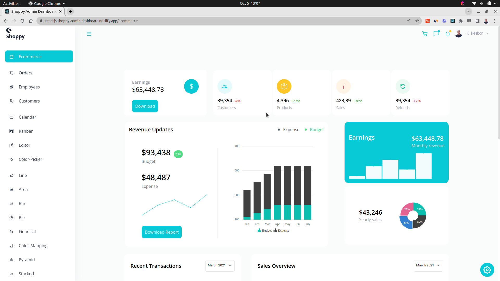](https://reactjs-shoppy-admin-dashboard.netlify.app/)

[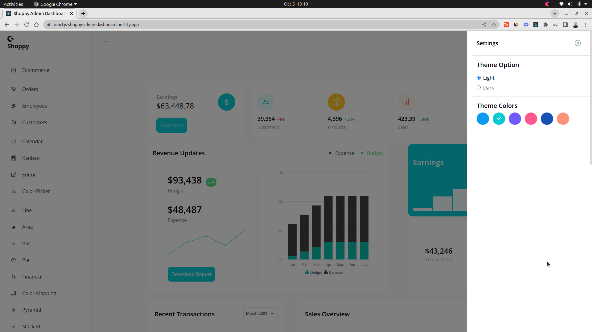](https://reactjs-shoppy-admin-dashboard.netlify.app/)

[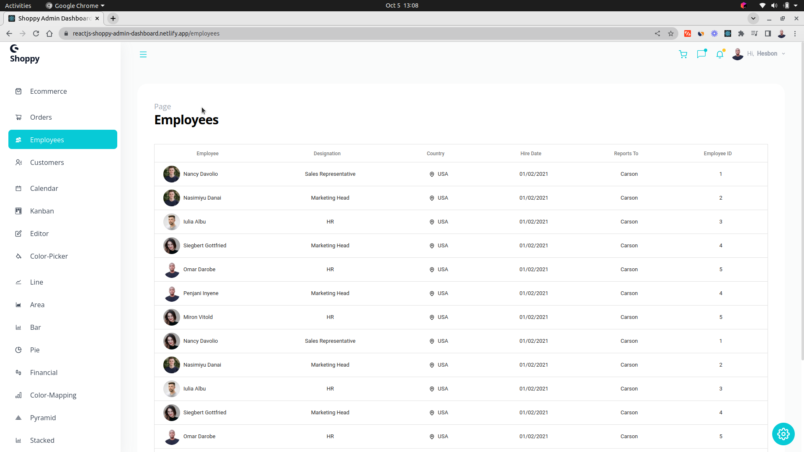](https://reactjs-shoppy-admin-dashboard.netlify.app/)

[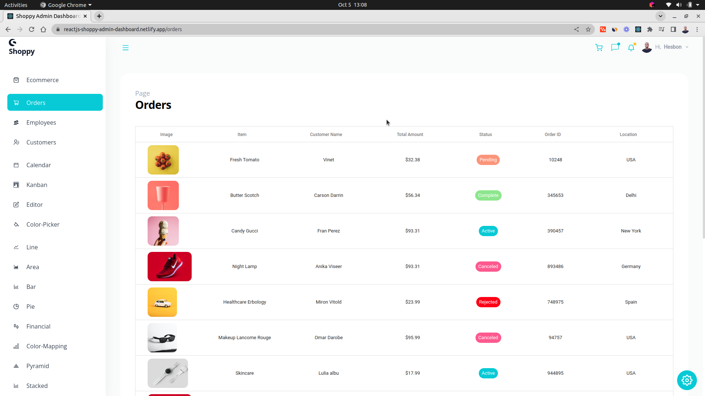](https://reactjs-shoppy-admin-dashboard.netlify.app/)

[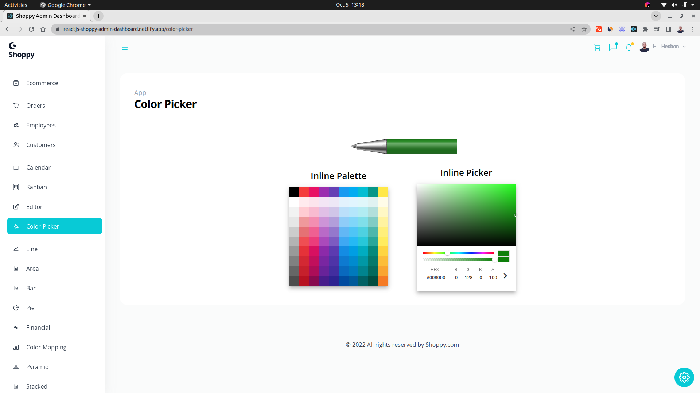](https://reactjs-shoppy-admin-dashboard.netlify.app/)

[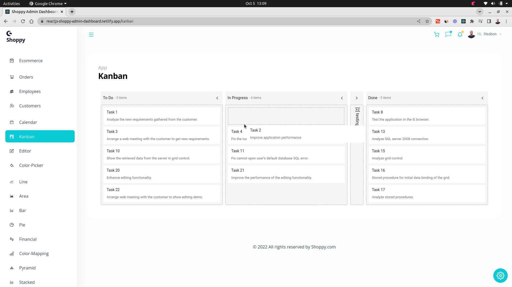](https://reactjs-shoppy-admin-dashboard.netlify.app/)

[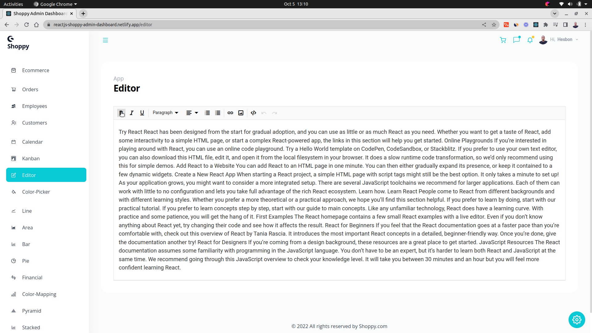](https://reactjs-shoppy-admin-dashboard.netlify.app/)

[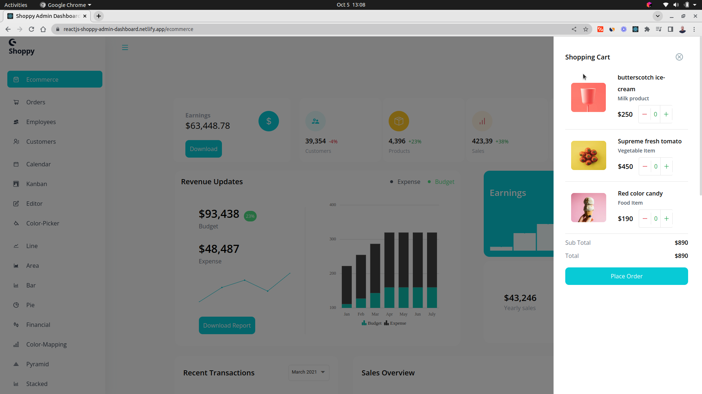](https://reactjs-shoppy-admin-dashboard.netlify.app/)

[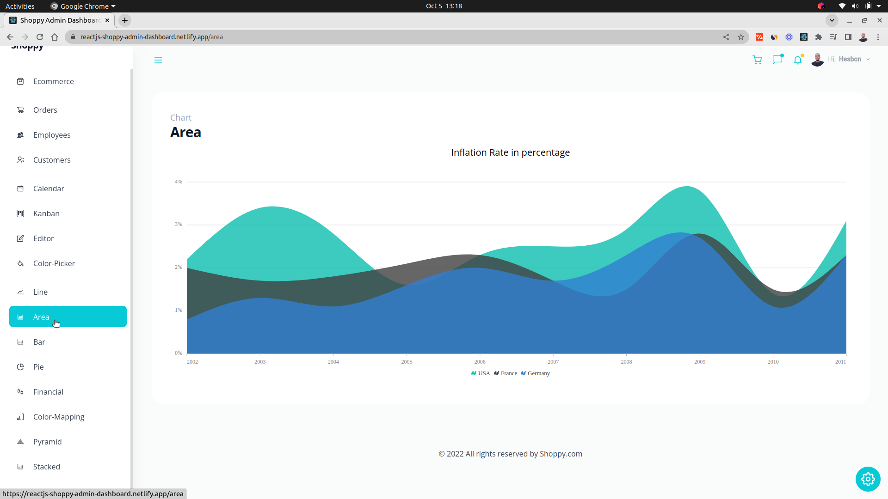](https://reactjs-shoppy-admin-dashboard.netlify.app/)

[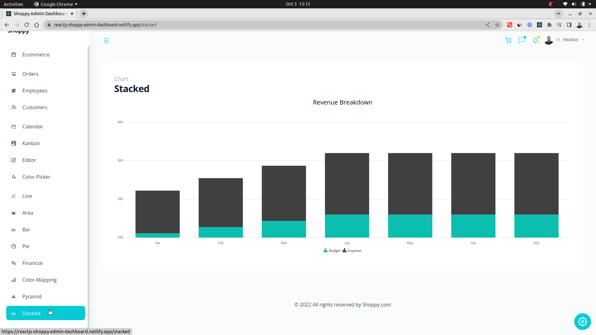](https://reactjs-shoppy-admin-dashboard.netlify.app/)

[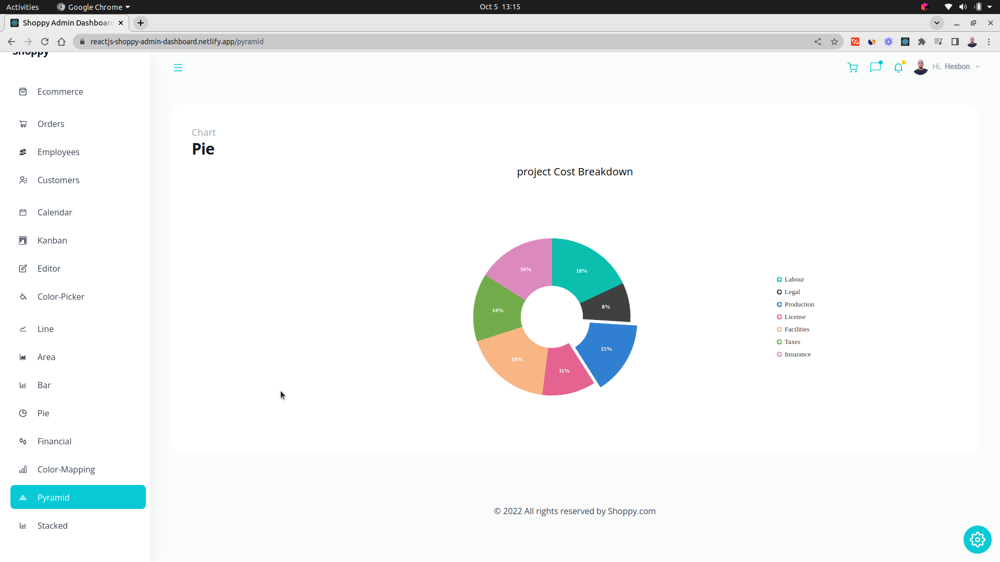](https://reactjs-shoppy-admin-dashboard.netlify.app/)

[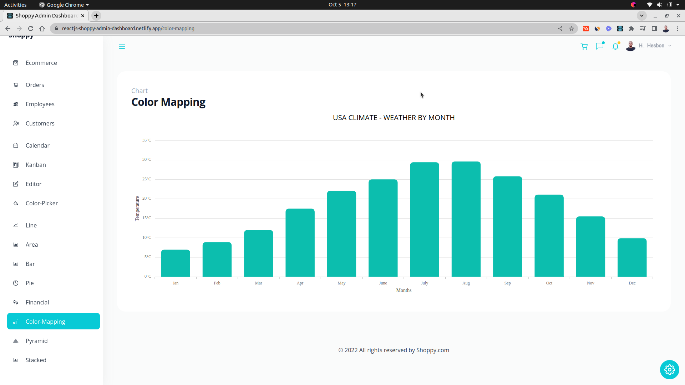](https://reactjs-shoppy-admin-dashboard.netlify.app/)

[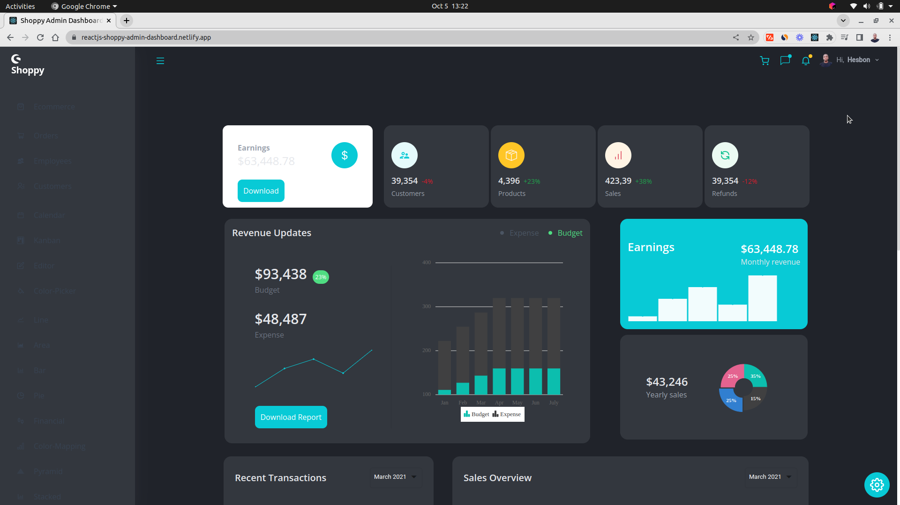](https://reactjs-shoppy-admin-dashboard.netlify.app/)

Admin Dashboard in React

## Technologies

- React
- Syncfusion
- TailwindCSS

## Features

- Dashboard
- Charts
- Calendar
- Theme
- Editor (WYSIWYG)
- Kanban
- Dropdowns
- Popups
- Schedules

## Setup

```code
# Clone this repo
git clone https://github.com/hesbon-osoro/shoppy-admin-dashboard.git

# Navigate to directory and install packages
cd shoppy-admin-dashboard && yarn

# Start the App
yarn start
```

[](https://www.buymeacoffee.com/wazimu)

